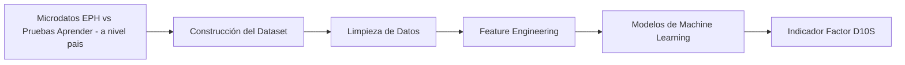

# Mentoría FAMAF 2026

<!-- Título -->

# El Factor D10S: Datos que predicen el abandono escolar antes de jugar el tiempo suplementario
### *Entender mejor. Detectar a tiempo. Actuar.*

El objetivo del proyecto es combinar los microdatos (anonimizados) de las pruebas Aprender a nivel país, con la Encuesta Permanente de Hogares (EPH-INDEC) para modelar y predecir factores de abandono escolar, contribuyendo al análisis educativo en Argentina.

<!-- Banner -->
<p align="center">
  
</p>

## **Intro**

En el fútbol argentino existen dos ejemplos icónicos de talento extraordinario: **Diego Maradona** y **Lionel Messi**.

Ambos comparten algo difícil de medir: una combinación única de habilidad, creatividad y capacidad de cambiar el resultado de un partido. A ese diferencial muchas veces se lo describe como talento excepcional.

Pero sus trayectorias emergen de contextos profundamente distintos.
La historia de Maradona suele asociarse a un entorno caótico, impredecible y altamente creativo, mientras que Messi se desarrolló en un contexto más organizado, metódico y estructurado.

A pesar de estas diferencias, ambos alcanzaron niveles extraordinarios de rendimiento. Esto plantea una pregunta interesante:
¿Las métricas nos enseñan algo más que goles y récords? ¿Cómo influyen el rendimiento físico vs el psicológico? y ¿Qué marca la verdadera diferencia en los partidos que se definen en los últimos minutos? 

Porque, como sabemos, cuando el tiempo reglamentario termina, aparece el **tiempo suplementario**: ese momento clave donde todavía puede pasar algo inesperado.

En los datos ocurre algo parecido.
A veces los números parecen claros, las métricas cierran…
pero siempre queda una pregunta más por hacer, un patrón más por entender, una historia más por descubrir.

Este proyecto no busca dar respuestas definitivas.
Busca algo quizás más interesante: propone “marcar la cancha” de un problema real -el abandono escolar- y recorrerlo con herramientas de análisis, modelos predictivos y, sobre todo, preguntas.

¿Cómo puede la Ciencia de Datos aportar nuevas miradas sobre el verdadero poder de la educación?

¿Podemos detectar señales tempranas de abandono escolar?

¿Existen patrones socioeconómicos que nos ayuden a entender mejor las trayectorias educativas?

Un proyecto pensado para explorar esos interrogantes, desde otra perspectiva. Encontrar oportunidades para intervenir, acompañar y sostener a quienes están en riesgo de quedarse fuera del juego.

---

## La Pregunta Científica

Toda investigación comienza con una pregunta clara.

En este proyecto intentaremos responder:

**¿Es posible identificar patrones que permitan predecir el abandono escolar en etapas tempranas mediante técnicas de Ciencia de Datos?**

Responder esta pregunta no solo tiene valor académico.

También puede aportar herramientas para comprender mejor las trayectorias educativas y los factores que influyen en ellas.

---

## Pipeline del Proyecto

En esta mentoría vamos a recorrer ese camino paso a paso, donde todo empieza con datos desordenados…
y termina (con suerte) en un modelo que nos ayuda a entender mejor un problema.



---

## Datos Utilizados

El dataset principal se construye a partir de la integración de dos fuentes oficiales:

Encuesta Permanente de Hogares (EPH)

Pruebas Aprender

Ambas fuentes presentan diferencias estructurales clave:

EPH → nivel individuo + hogar

APRENDER → nivel individuo + escuela

Esto introduce un desafío técnico central:
la unificación de la cartografía, necesaria para poder realizar un matching territorial que permita vincular condiciones socioeconómicas con trayectorias educativas.

🧠 Construcción del dataset

El proceso no se limitó a la integración de fuentes, sino que incluyó una curaduría intensiva de variables.

A partir de un diccionario original de más de 1200 variables de APRENDER, se realizó:

Normalización y limpieza de variables

Identificación de familias de variables (ej: variables mensuales)

Clasificación por dimensiones analíticas:

Características del estudiante

Trayectoria educativa

Contexto socioeconómico

Desempeño académico

Filtrado basado en:

Relevancia teórica para abandono escolar

Calidad y redundancia

Compatibilidad con variables disponibles en EPH

Este proceso permitió reducir significativamente la dimensionalidad, priorizando variables interpretables y utilizables en el cruce entre fuentes.

🔗 Criterio de integración con EPH

Se definió un subconjunto de variables con potencial de vinculación directa o indirecta con EPH, incluyendo:

Edad

Sexo

Nivel educativo de padres

Situación laboral

Condiciones del hogar

Acceso a tecnología (internet, computadora)

Indicadores socioeconómicos

Además, se construyó un mapeo de variables estandarizadas, generando un puente semántico entre ambas fuentes.

🧱 Dataset final

El dataset resultante contiene variables agrupadas en dimensiones clave:

👤 Características del estudiante

Edad

Sexo

📊 Trayectoria educativa

Repitencia

Asistencia / inasistencia

Sobreedad

🏠 Contexto socioeconómico

Nivel educativo de padres

Situación laboral

Ingreso del hogar

Condiciones habitacionales

Acceso a tecnología

📚 Desempeño académico

Puntajes en Lengua y Matemática

🎯 Objetivo analítico

Este dataset permitirá explorar la relación entre:

condiciones socioeconómicas y trayectorias educativas,
con foco en la identificación de factores asociados al riesgo de abandono escolar.

Más que integrar datos, este proyecto busca integrar contextos:
conectar lo que ocurre en el hogar con lo que sucede en la escuela.

---

## Estructura del Repositorio

```
Proyecto_Mentoria_FAMAF_2026
│
├── data
│   ├── raw
│   ├── cleaned
│   └── processed
│
├── notebooks
│
├── src
│
├── docs
│
├── images
│
└── deliverables
```

Cada carpeta cumple un rol específico dentro del flujo de trabajo del proyecto.

---

## Entregables de la Mentoría

El proyecto se desarrollará en tres entregas principales que reflejan etapas reales de un proyecto de Ciencia de Datos.

### Deliverable 1 — Data Pipeline

Construcción del pipeline de datos:

- Descarga de datasets
- Limpieza de datos
- Integración de múltiples fuentes
- Construcción del dataset inicial

---

### Deliverable 2 — Exploratory Data Analysis

Análisis exploratorio del dataset:

* Análisis de variables
* Visualización de datos
* Detección de patrones iniciales
* Generación de hipótesis

---

### Deliverable 3 — Predictive Models

Entrenamiento y evaluación de modelos de Machine Learning:

* Selección de variables
* Entrenamiento de modelos
* Evaluación de desempeño
* Interpretación de resultados

A partir de estos modelos se explorará la construcción del indicador experimental **Factor D10S**.

---

## Herramientas Utilizadas

Durante la mentoría utilizaremos herramientas habituales en proyectos profesionales de Ciencia de Datos:

* Python
* Pandas
* Scikit-learn
* Jupyter Notebooks
* Visualización de datos
* Machine Learning

El objetivo es que cada integrante de la mentoría experimente un flujo de trabajo similar al de un proyecto profesional real.

---

## FAQs

### ¿Qué vas a aprender en esta mentoría?

Participar en este proyecto te permitirá desarrollar habilidades clave en Ciencia de Datos:

* Análisis exploratorio de datos
* Construcción y limpieza de datasets
* Entrenamiento de modelos de Machine Learning
* Comunicación de resultados con datos

---

### Este proyecto NO es para vos si…

* Buscás que todo esté resuelto paso a paso
* No te interesa trabajar en curación de datos 
* Preferís proyectos puramente teóricos
* No te gusta investigar patrones en datos

La Ciencia de Datos es, en esencia, un proceso de exploración y descubrimiento.

---

## ¿Cuál es el objetivo final de la mentoría?

Más allá de lo académico, el objetivo es que los integrantes desarrollen un proyecto completo de Ciencia de Datos con datos reales.

La meta es lograr experiencia en todas las etapas del proceso:

* Construcción de datos
* Análisis exploratorio
* Modelado predictivo
* Interpretación de resultados

Una experiencia lo más cercana posible a un proyecto profesional real.

---

## Cierre

En el fútbol, detectar talento temprano puede cambiar una carrera.

En educación, detectar trayectorias en riesgo puede cambiar una vida.

Porque a veces, detrás de un estudiante que parece perderse del sistema educativo, hay señales que simplemente no fueron vistas a tiempo.

Este proyecto propone explorar si la Ciencia de Datos puede ayudarnos a entender mejor esos procesos.

Si esta idea despertó tu curiosidad… **quizá sea momento de salir a la cancha.**

El juego está por comenzar..!

---

**Mentoría FaMAF — Ciencia de Datos**

By Noe Ferrero


